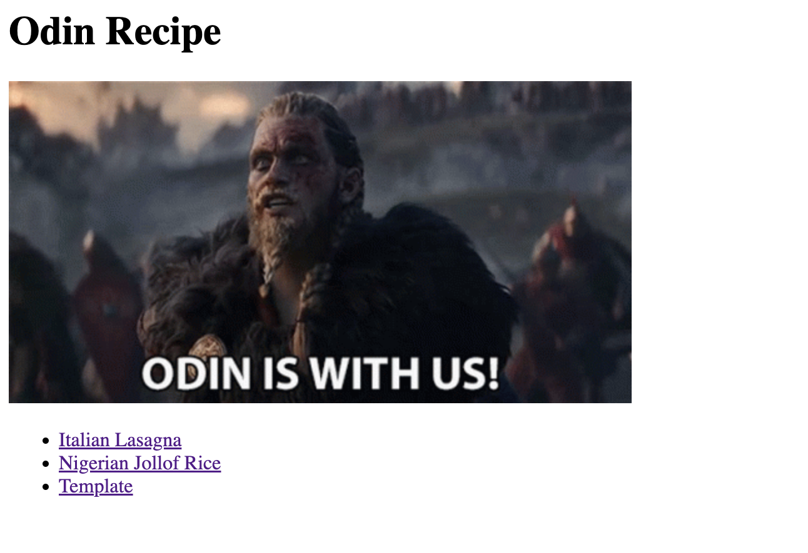
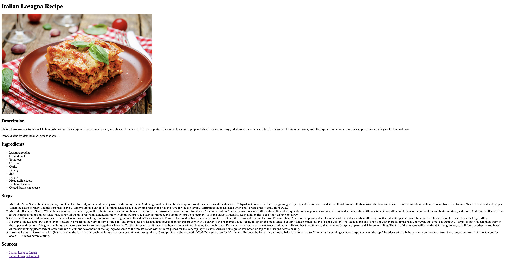
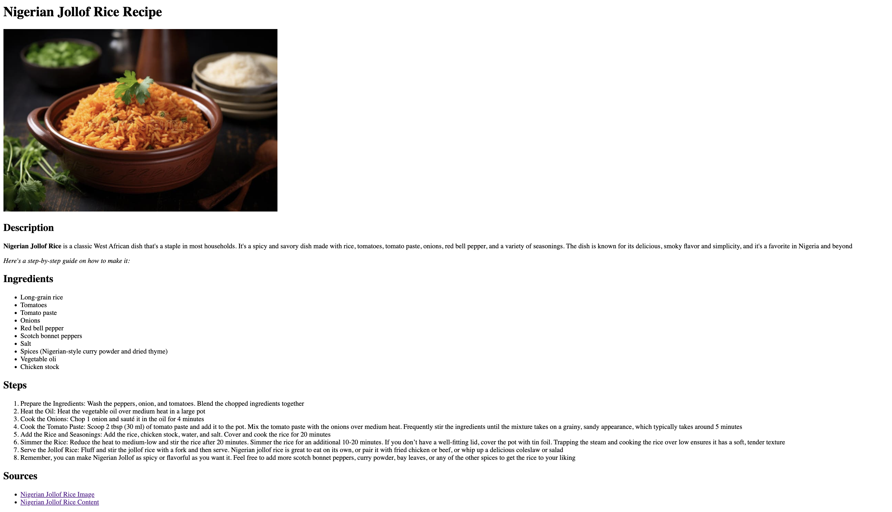
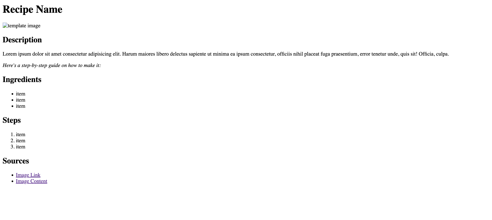

# Recipes

This project is an exercise in the application of HTML5 to develop a comprehensive recipe webpage. The techniques and methodologies implemented are strictly derived from the curriculum provided in the Odin Project’s relevant [HTML Foundations](https://www.theodinproject.com/paths/foundations/courses/foundations#html-foundations) sections. This endeavor serves as a testament to the practical application of learned concepts in a professional setting.

[https://www.theodinproject.com]()

